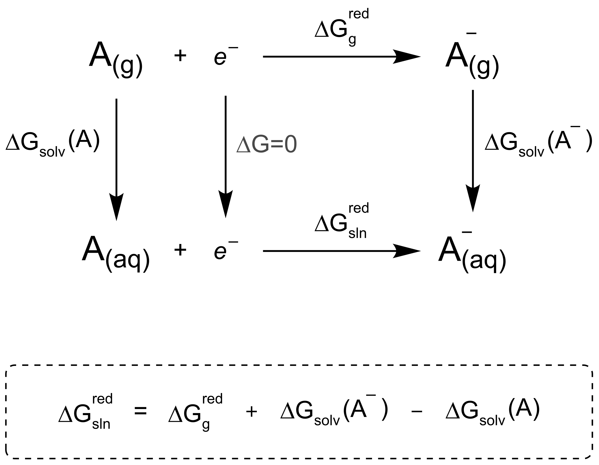

# Modulation of the Meisenheimer complex metabolism of nitro-benzothiazinones by targeted C-6 substitution - *supporting code*

&nbsp;

This repository contains the necessary code and raw data to reproduce the analysis described in our manuscript [Keiff et al]().

&nbsp;

## Requirements

For reproducibility purposes, it is recommended to run the code in a dedicated `conda` environment. For data analysis, only `Python` libraries commonly used in Chemoinformatics are required, as indicated in the `environment.yml` file. To set up the environment first install a `conda` distribution (e.g. `miniconda`; follow instructions in the [official Anaconda website](https://docs.anaconda.com/free/miniconda/miniconda-install/)). Afterward, create the environment as follows:

```
$ conda env create -f environment.yml
```

To run reaction energy profiles or redox potential calculations using our scripts, as described in the manuscript, [autodE](https://github.com/duartegroup/autodE) must be installed along side with [ORCA](https://sites.google.com/site/orcainputlibrary/home) and [XTB](https://github.com/grimme-lab/xtb).

&nbsp;

## Details

* `redox_potential.py` runs optimization and single point energy calculations for the lowest energy conformer of a series of compounds, starting from SMILES strings. Calculations for the neutral (given form = oxidized form) and the corresponding radical anion (reduced form) are performed using the automation and wrapper functionalities of `autodE`. Calculation of the reduction potential is performed with the `calculate_redox_potential` function in `utils.py`, following a classical thermodynamic cycle approach as shown below.

  <p align="center">
  
  </p>

  For further information on the script, see help:
  ```
  $ python redox_potential.py -h
  ```

* `reactivity.py` allows to sequentially calculate reaction energy profiles at DFT level for a set of reactions of interest. It creates a new folder to store the results individually obtained by `autodE`. Use help to see the available options:
  ```
  $ python reactivity.py -h
  ```

* `reaction_profile_summary.py` helps retrieving data from a series of calculations in `autodE` (as those obtained from `reactivity.py`). All the evaluated folders must be on the current directory. It generates a CSV file containing the respective reaction energetics (&Delta;E, &Delta;E‡, &Delta;G, &Delta;G‡). 

* The `notebooks`, as their names indicate, contain some data preparation and analysis to obtain the figures shown in the paper.

* `inputs` contains a CSV and a SMI file used as input for `reactivity.py` and `redox_potential.py`, respectively.

* `data` contains separate files with calculated and experimental properties for each compound under study. It also includes the atom numbers for the nitro-BTZ core for each structure according to the respective Jaguar outputs.

* `results` contains an Excel file, which presents calculated data combined with the experimentally measured properties for the ease of analysis and visualization.

* `lib` contains custom Python modules necessary for the use of the above-mentioned scripts and notebooks. 

    * `descriptors.py` presents a Python class to preprocess QM descriptors obtained from Jaguar calculations after retrieval with the Schrödinger's `qm_descriptors.py` script.

    * `redox.py` presents a Python class based on the `Reaction` class of `autodE` to perform automatic energy calculations at DFT level for neutral and radical anion forms of given species, for subsequent redox potential calculation. 

    * `utils.py` is a module containing functions to calculate reaction energetics from `autodE` or `reactivity.py` outputs, and redox potential from `redox_potential.py` outputs. Functions to calculate statitical correlations, combine calculated properties with experimental data, and process protein-ligand interactions from Schrödinger's SID are also included.


&nbsp;

## Citation
```
@article{,
  doi = {},
  url = {},
  year = {},
  month = ,
  publisher = {},
  volume = {},
  number = {,
  pages = {},
  author = {},
  title = {},
  journal = {}
}
```
